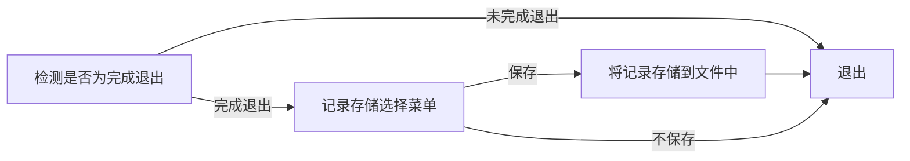

# 排行榜功能 Version 2

## 1. 构思

游戏正常完成后，可以选择是否计入排行榜  
如果选择计入则输入名字完成署名  
然后将内容存储至对应地图的排行榜文件中  

可以调出排行榜，按体力消耗从低到高排名  

暂时考虑只支持默认地图的排行榜功能  
同时只支持存入，或是排行榜整体初始化，而不支持部分删除记录  

## 2. 设计

**排名存储：**



**排行榜调用：**

1. 这里可以考虑使用链表实现
2. 将排行榜读入到链表中  
3. （读入的时候就可以形成）有序链表排序  
4. 顺序输出  

```mermaid
排行榜-->选择地图
```

### 3. 实现

1. 可以发现game